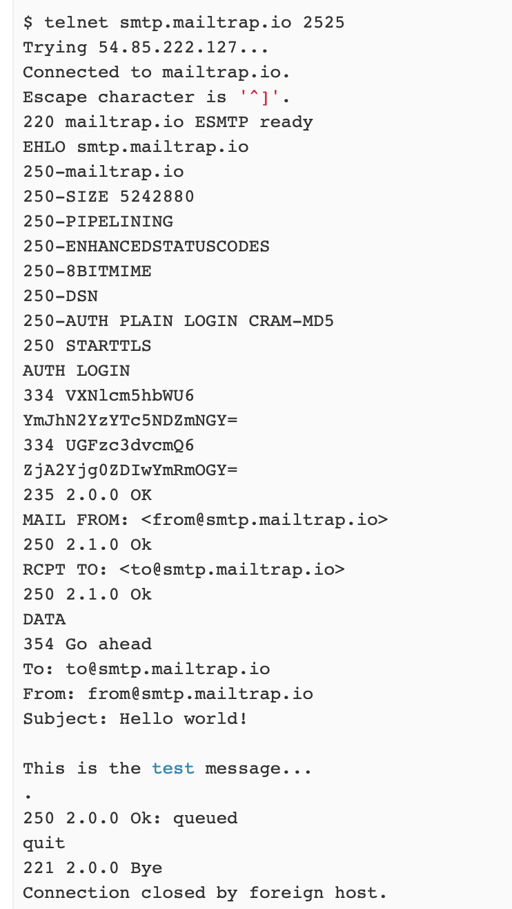

# HEIGVD-RES-2019-Labo-SMTP
## MailPrank - Budry Nohan, Moreno Andrés
### Objectives
In this lab, we developed a client application (TCP) in Java. This client application uses the Socket API to communicate with an SMTP server. The code include a partial implementation of the SMTP protocol. These were the objectives of the lab:

- Make practical experiments to become familiar with the SMTP protocol. 

- Understand the notions of test double and mock server, which are useful when developing and testing a client-server application.

- Understand what it means to implement the SMTP protocol and be able to send e-mail messages, by working directly on top of the Socket API (i.e. you are not allowed to use a SMTP library).

- See how easy it is to send forged e-mails, which appear to be sent by certain people but in reality are issued by malicious users.

- Design a simple object-oriented model to implement the functional requirements described in the next paragraph.

### The lab/project

The mission was to develop a client application that automatically plays pranks on a list of victims:

- The user is able to define a list of victims ( file containing a list of e-mail addresses).

- The user is able to define how many groups of victims should be formed in a given campaign. In every group of victims, there is 1 sender and at least 2 recipients (i.e. the minimum size for a group is 3).

- The user is able to define a list of e-mail messages. When a prank is played on a group of victims, then one of these messages is selected. The mail is sent to all group recipients, from the address of the group sender. In other words, the recipient victims is lead to believe that the sender victim has sent them.

### Main source of inspiration

In order to start our project, our main source of inspiratin were four WebCast given by our teacher, Olivier Liechti. (Youtube channel https://www.youtube.com/user/oliechti/playlists ).


## Installation
### Downloads 

To configure and run the application there are two possibilities:

- Clone the repo. Run `mvn package` inside the folder "MailPrank/". This will create a zip at "MailPrank/target/mailprank-1.0.zip". This zip contains the executable jar with the config files. In the folder "MockMockDocker/", you can find what's needed to create the mock SMTP server with docker.
- If you don't want to clone all the repo, you can download "mailprank-1.0.zip" and "MockMockDocker.zip" [here](https://github.com/Jack-Eri/MailPrank/releases/tag/1.0).

### Setting up a mock SMTP server with Docker

To run a smtp server, you can use the dockerfile provided to create an image that contains a [MockMock](https://github.com/tweakers/MockMock) server.

1. Go to the folder MockMockDocker. There is a Dockerfile and the MockMock server executable.

2. Create the image using the folowing command.

   ```bash
   docker build -t mockmock <Path/To/Dockerfile>
   ```

   You may change the the name of the image by replacing "mockmock".

3. Your docker file is now ready and you can see it by typing `docker images` (it should appear on the list).

4. Run a container of this images.

   ```bash
   docker run -d -p 8282:8282 -p 2525:2525 mockmock
   ```

   - -d: makes the container run in background.
   - -p exposes a port used by MockMock. MockMock uses the port 8282 for the web interface and 2525 for the smtp server.
   - Mockmock is the name of the image to run.

5. Now You can go to http://localhost:8282 to see the web interface and connect to the smtp server with localhost and 2525 (for exmple: `telnet localhost 2525`).

### Configuration

There are some configuration do do before runne the application. Decompress the zip and go inside the folder "mailprank-1.0/". Here are all the config files and the executable jar.

- Edit "emails.txt" to write the list of victims. You must write one e-mail per line (as in the default content).
- Edit "pranks.txt" with all the different pranks you want to send. The first line of each prank is the subject. And the body starts a the third line. The second line is ignored. You must separate each prank with a specific separator (in one line). By default, the separator is "---" but you can modify it in the "config.properties".
- Then in the "config.properties" you must set the host and the port of the SMTP server. You may need to add the username and password (encoded in base64) depending of the server used. For the other properties, follow the documentation written in the file. By default, the config file is ready to use with the MockMock server created above.

### Running

To run the application you can simply double click "mail prank-1.0.jar", but you won't have any information of whether it worked or not.

If you want some feedback, open a terminal and go in the same folder as the executable "mail prank-1.0.jar" (this is important for the jar to find the config files). Then run `java -jar mailprank-1.0.jar`.

#### Example using Mailtrap:



### Implementation:

The program can be divided in 4 blocks:

1. The Smtp
2. The victims
3. The pranks
4. The main (MailPrank)


The Smtp block takes care of the creation of a Client (all the interaction with the server), and the creation of an mail. The victims block reads the mails from a resource file, creates the victims and generates the groups. The pranks block reads the pranks from a resource file and generates the pranks. Finally the main, will execute the program.


